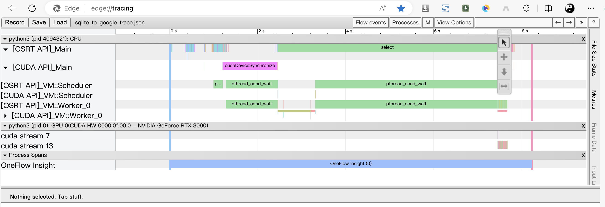

# OneFlow Insight

## Overview

OneFlow Insight is a module designed for profiling CUDA kernel execution time and bottleneck analysis. Typically, this is done using the nsys command provided by Nvidia, which generates corresponding profile files (formerly .qdrep and now .nsys-rep). These files can be visualized and analyzed using Nvidia's GUI software, Nsight Systems.

In addition to generating profile files, nsys also produces platform-independent data information recorded in a .sqlite file. The OneFlow Insight module can parse this .sqlite file to generate a JSON file formatted according to the Google Chrome Trace Event standard. This allows for direct visualization and analysis through Chrome or Edge browsers using chrome://tracing/ or edge://tracing/ (supported by trace-event-profiling-tool, see:https://www.chromium.org/developers/how-tos/trace-event-profiling-tool/).


## Usage

1. Generate profile files using the following nsys command:

    ```bash
    nsys profile --export=sqlite -o profile_data
    ```

    This will produce .nsys-rep files along with a .sqlite file.

2. Use OneFlow Insight to parse the .sqlite file and generate a JSON file:

    ```bash
    python3 sqlite_to_google_trace_event.py --input 'profile_data.sqlite' -o trace.json
    ```

3. Open Chrome or Edge browser and navigate to chrome://tracing/ or edge://tracing/.

4. Load the generated trace.json file for visualizing and analyzing the profiling data.

## Visualization Example



The above image demonstrates the visualization capabilities using Chrome or Edge browser with the generated JSON file.

Feel free to explore and gain insights into your CUDA kernel execution performance!
